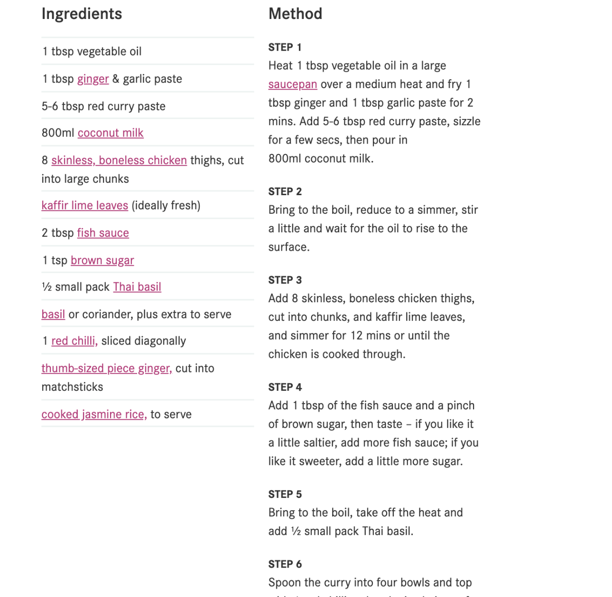

# 🌶️ Thai Curry (Rautt/Grænt)

Ég prófaði að setja Tofu út í en kjúklingur er líka mjög góður! Ef maður vill gera grænt þá notar maður bara grænt curry paste úr búð og rautt curry paste fyrir rautt.

Ég setti baunir út í réttinn en það má setja HVAÐ SEM ER. Gulrætur, sætar, blómkál, eggaldin, spínat bara whatever.

> Byggt að hluta til á [þessari BBC uppskrift](https://www.bbcgoodfood.com/recipes/thai-red-curry)

---

## 📋 Innihald

- 1 laukur
- 1 chili (ekki of sterkt, má sleppa annars)
- Engifer bútur
- 3-5 hvítlauksrif
- Green/Red curry paste (keypt út í búð)
- 1 kókosmjólk í dós
- Tofú/Kjúklingur
- Auka grænmeti sem til er (dæmi: green beans, sætar, gulrætur, eggaldin etc).
- AUKA DÓT SEM ER GOTT (það gefur mun meira bragð)
  - Fiskisósa (soya líka hægt?)
  - sítrónugras/lemon grass (ég átti þetta ekki)
  - Lime
  - Smá sykur

---

## 👨‍🍳 Aðferð

1. Laukur, chili, engifer, hvítlaukur er annað hvort saxað smátt eða sett í blandara og hakkað allt saman. Svo sett á pönnu með bara smá olíu. Þetta er bara til að ná úr smá vökva
2. Eftir smá stund er Curry paste sett út í ásamt kókosmjólk.
    1. Ef aukadót er til, þá setja það núna
3. Grænmeti sett út í með tofu/kjúkling
4. Leyft að malla þar til öll hráefnin eru elduð eða þangað til maður vill borða
5. Hrísgrjón eru nice með

---

