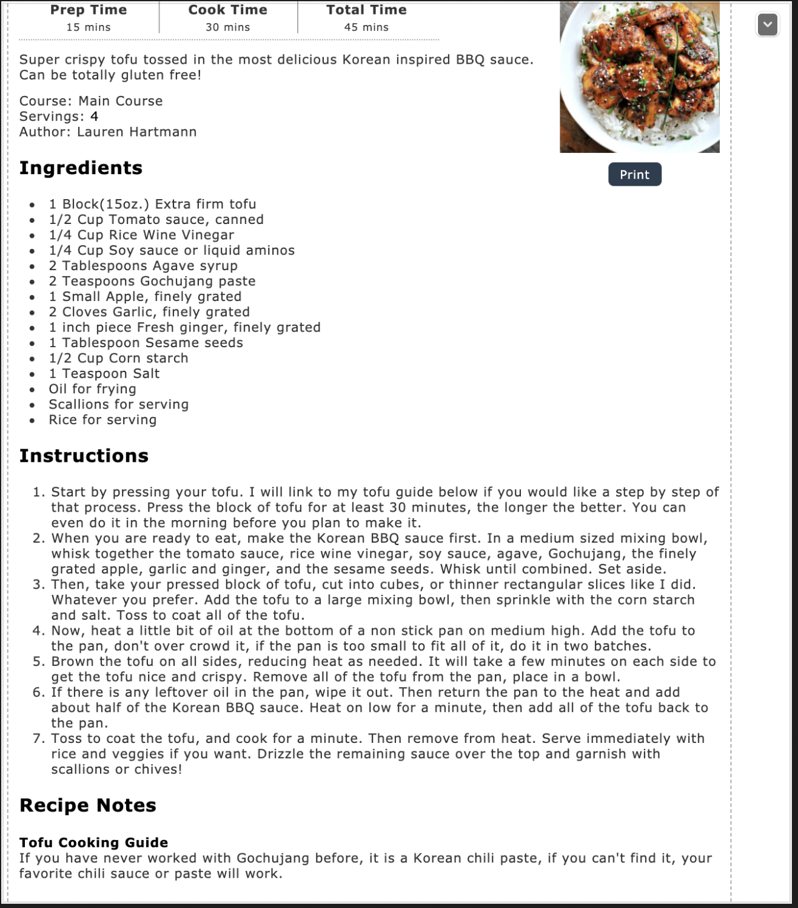

# 🍖 Vegan Korean BBQ tofu

> Byggt á [þessari uppskrift](https://www.rabbitandwolves.com/vegan-crispy-korean-bbq-tofu/)

---

## 👨‍🍳 Aðferð

1. Pressa tófú með handklæði í sirka 30 min
2. Útbúa [Korean BBQ sósu](bbq_sauce.md)
3. Velta tófu upp úr kornsterkju. Passa að hafa bitana breiða og mjóa
4. Steikja tófu á pönnu við frekar háan hitan og gefa nógan tíma. Það má fara nóg salt á tófú-ið hér því það er frekar bragðlaust eitt og sjér. Sérstaklega ef maður vill bara steikja tófú-ið en ekki setja það i sósuna. Setja svo tilhliðar
5. Blanda öllu saman

---

